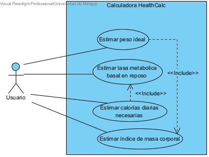

# isa2025-healthcalc
Health calculator used in Ingeniería del Software Avanzada

# PRACTICA 1

## Casos de prueba para HealthCalc 

### Casos de prueba para el metodo idealWeight

1. `height` no puede ser **0 o negativo** → Debe lanzar una excepcion.  
2. `height` debe estar en **centimetros**.  
3. `gender` solo puede ser **'m'** o **'w'** → Si se introduce otro carater, debe lanzar una excepcion.  
4. El resultado **debe ser positivo** y estar en **kg**.
5. Alturas **muy bajas y muy altas**: `50 cm` vs. `250 cm`.  
6. Genero en **minuscula** (`'m'`, `'w'`).  
7. Valores **con decimales** en la altura (`175.5 cm`).  
8. **Entrada de datos incorrecta**: `null`, valores vacios o caracteres en la altura.  
  
### Casos de prueba para el metodo basalMetabolicRate

1. `weight` no puede ser **0 o negativo** → Debe lanzar una excepcion.  
2. `weight` debe estar en **kg**.  
3. `height` debe estar en **cm**.  
4. `age` no puede ser **negativo, cero o un numero demasiado alto** (`>100 años`).  
5. `gender` solo puede ser **'m'** o **'w'** → Si es diferente, debe lanzar una excepcion.  
6. El resultado **no debe ser negativo ni cero**.  
7. Valores **extremos** de peso (`30 kg`, `300 kg`).  
8. Valores con **decimales** en peso (`65.7 kg`) y edad (`25.5 años`).  
9.  Valores **no numericos o vacios** en cualquier parametro.  

# PRACTICA 2
## Diagrama de caso de uso modificado  

## Especificación de caso de uso

### 1. Nombre  
**Estimar calorías diarias necesarias**  

### 2. Actor Principal  
**Usuario** (persona que quiere saber cuántas calorías debe consumir diariamente según su actividad física).  

### 3. Ámbito  
**Calculadora HealthCalc**.  

### 4. Nivel  
**Alto nivel**, relacionado con la funcionalidad principal de la aplicación.  

### 5. Stakeholders y sus intereses  
- **Usuario**: Desea conocer cuántas calorías diarias debe consumir según su actividad física.  
- **Desarrolladores**: Quieren que la aplicación funcione adecuadamente.  

### 6. Precondiciones  
El usuario debe ingresar los siguientes parámetros para realizar el cálculo:  
- **Género**  
- **Altura (cm)**  
- **Peso (kg)**  
- **Actividad física**  
- **Edad**  

### 7. Garantías mínimas  
Se muestra un mensaje de error si los parámetros ingresados no son válidos o falta algún parámetro.  

### 8. Garantías de éxito  
Se muestra al usuario las calorías necesarias según los datos aportados.  

---

### 9. Escenario principal  
9.1. El usuario selecciona la opción **"Estimar calorías diarias necesarias"** en la calculadora.  
9.2. El sistema solicita los datos al usuario (**altura, peso, edad, género, actividad**).  
9.3. El usuario introduce los datos y confirma la operación.  
9.4. El sistema calcula la **Tasa Metabólica Basal (TMB)** según los datos introducidos y los muestra en pantalla.  
9.5. El usuario recibe los resultados y puede realizar otro cálculo.  

---

### 10. Escenarios alternativos  
10.1. El usuario no ingresa todos los datos  
  - El sistema muestra un mensaje indicando que faltan campos por completar.  

10.2. El usuario ingresa datos erróneos  
  - El sistema muestra un mensaje de error indicando que los datos son incorrectos.  