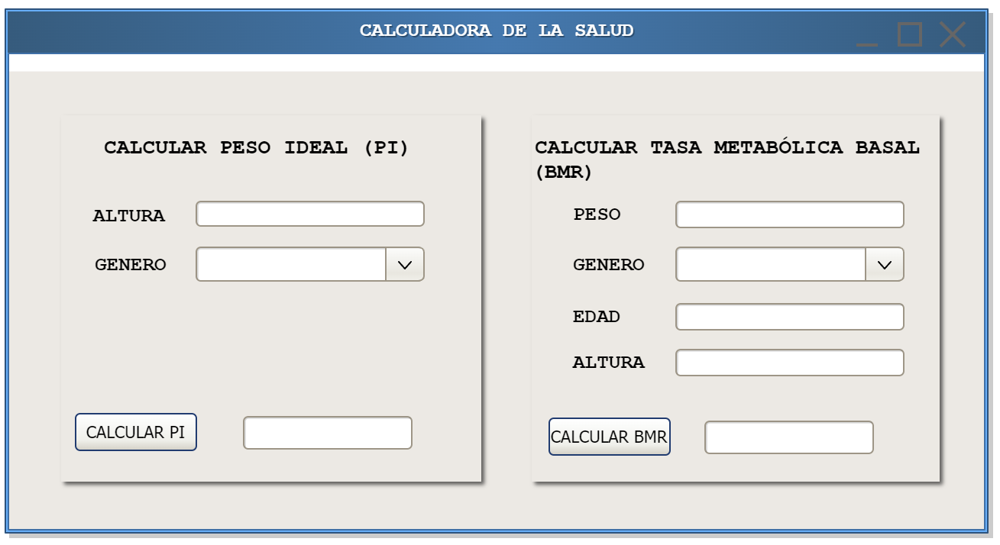
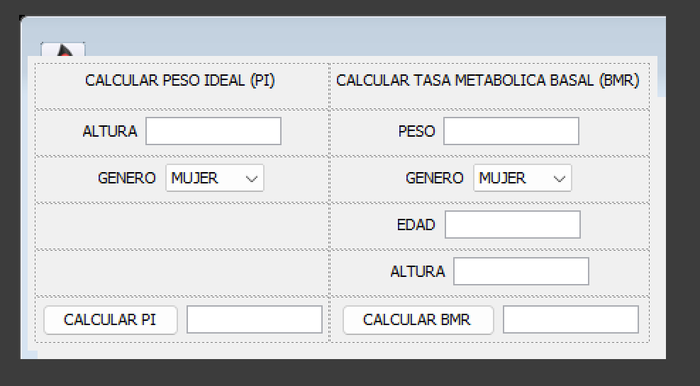
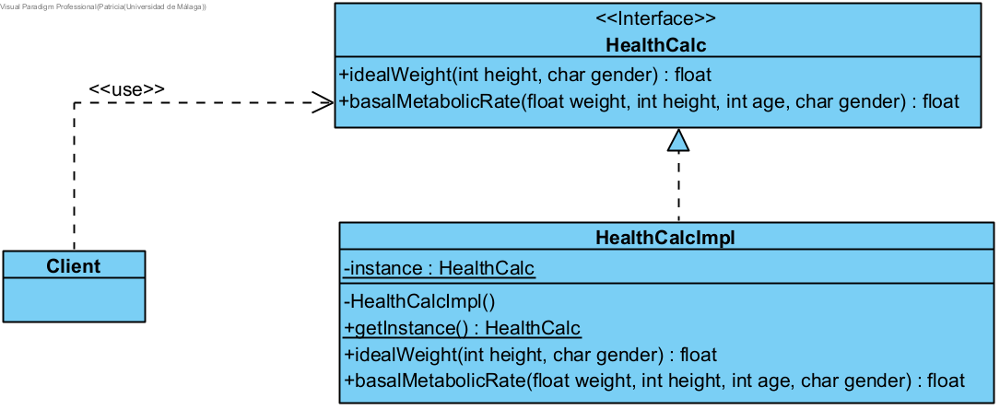
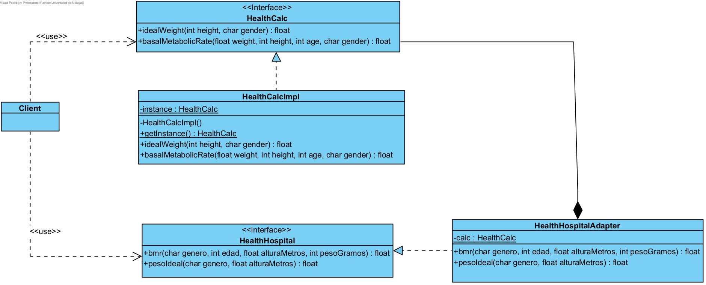
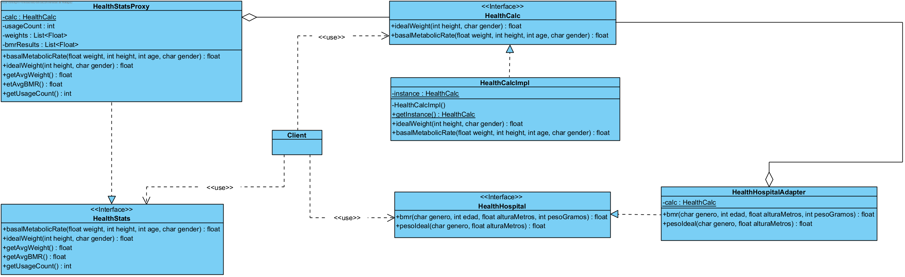
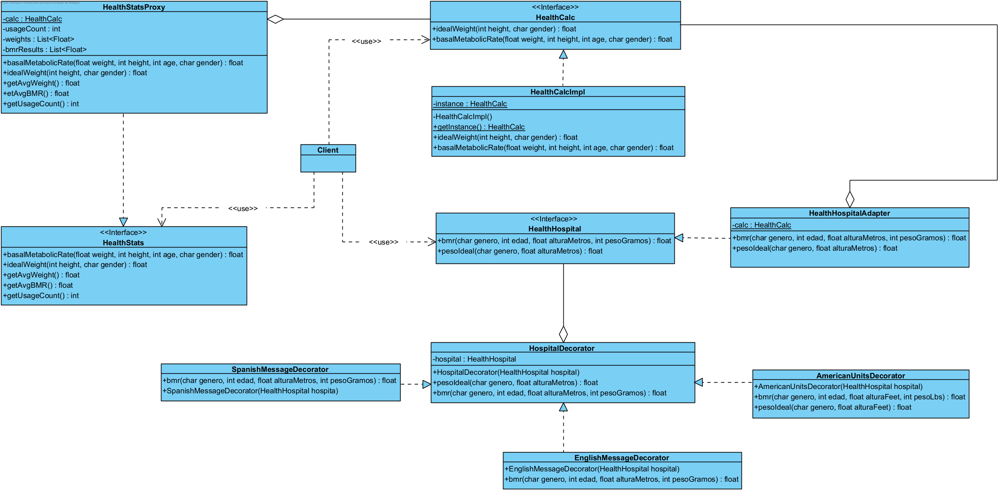

# isa2025-healthcalc
Health calculator used in Ingeniería del Software Avanzada

# Casos de prueba para HealthCalc P1

### Casos de prueba para el metodo idealWeight

1. `height` no puede ser **0 o negativo** → Debe lanzar una excepcion.  
2. `height` debe estar en **centimetros**.  
3. `gender` solo puede ser **'m'** o **'w'** → Si se introduce otro carater, debe lanzar una excepcion.  
4. El resultado **debe ser positivo** y estar en **kg**.
5. Alturas **muy bajas y muy altas**: `50 cm` vs. `250 cm`.  
6. Genero en **minuscula** (`'m'`, `'w'`).  
7. Valores **con decimales** en la altura (`175.5 cm`).  
8. **Entrada de datos incorrecta**: `null`, valores vacios o caracteres en la altura.  
  
### Casos de prueba para el metodo basalMetabolicRate

1. `weight` no puede ser **0 o negativo** → Debe lanzar una excepcion.  
2. `weight` debe estar en **kg**.  
3. `height` debe estar en **cm**.  
4. `age` no puede ser **negativo, cero o un numero demasiado alto** (`>100 años`).  
5. `gender` solo puede ser **'m'** o **'w'** → Si es diferente, debe lanzar una excepcion.  
6. El resultado **no debe ser negativo ni cero**.  
7. Valores **extremos** de peso (`30 kg`, `300 kg`).  
8. Valores con **decimales** en peso (`65.7 kg`) y edad (`25.5 años`).  
9.  Valores **no numericos o vacios** en cualquier parametro.  

### Práctica 4: Interfaz gráfica de usuario

**Boceto HealthCalc hecho en Pencil:**  

**Diseño final de HealthCalc hecho en WindowBuilder:**  

### Práctica 6: Patrones de diseño

**EJERCICIO 1**
**Patrón Singleton:**

**EJERCICIO 2**
**Apartado a: Patrón Adapter**

**Apartado b: Patrón Proxy**

**Apartado c: Patrón Decorator**

### Práctica 7: Refactoring

#### Refactoring 1

**(1) Bad Smell:** Clase con demasiadas responsabilidades (Dios)  
**(2) Refactoring aplicado:** Extracción de interfaz (`HealthCalc`), creación de implementación concreta (`HealthCalcImpl`)  
**(3) Tipo:** Class refactoring  
**(4)** Se ha extraído la lógica de cálculo de peso ideal y tasa metabólica basal a una clase concreta que implementa una interfaz común. Esto facilita la inyección de dependencias y desacopla el sistema.  
**(5) Cambios manuales:** 2 clases nuevas creadas (`HealthCalc`, `HealthCalcImpl`), 10 líneas modificadas en clases existentes.  

---

#### Refactoring 2

**(1) Bad Smell:** Duplicación de lógica de validación en métodos  
**(2) Refactoring aplicado:** Consolidación de validaciones dentro de métodos  
**(3) Tipo:** Method refactoring  
**(4)** Se ha agrupado y centralizado la lógica de validación de entradas en los métodos `idealWeight` y `basalMetabolicRate` de `HealthCalcImpl` para evitar repetición.  
**(5) Cambios manuales:** 2 métodos modificados, 15 líneas ajustadas manualmente.  

---

#### Refactoring 3

**(1) Bad Smell:** Métodos con muchos parámetros  
**(2) Refactoring aplicado:** Introducción del objeto parámetro (`Person` y `BasicPerson`)  
**(3) Tipo:** Class refactoring + Method refactoring  
**(4)** Se han reemplazado los múltiples parámetros por un único parámetro `Person` para facilitar la extensibilidad y claridad del código.  
**(5) Cambios manuales:** 3 clases modificadas (`HealthCalcImpl`, `HealthStatsProxy`, `Controlador`), 12 líneas ajustadas.  

---

#### Refactoring 4

**(1) Bad Smell:** Conversión manual de tipos desde interfaz gráfica  
**(2) Refactoring aplicado:** Adaptación del controlador para usar `Person` y `Gender`  
**(3) Tipo:** Method refactoring  
**(4)** Se ha modificado el controlador para transformar las entradas de la interfaz gráfica a un objeto `BasicPerson` con el tipo enumerado `Gender`.  
**(5) Cambios manuales:** 1 clase modificada, 10 líneas modificadas manualmente.  
